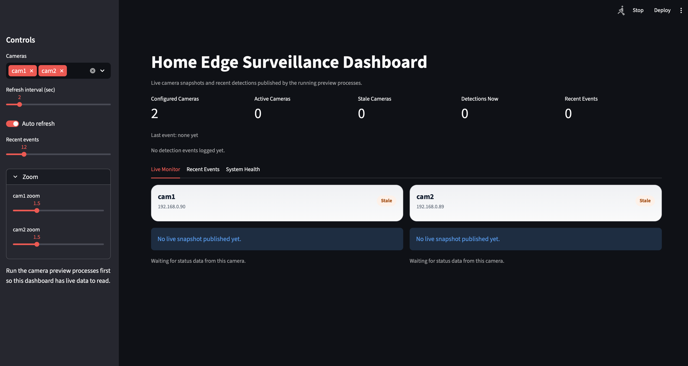
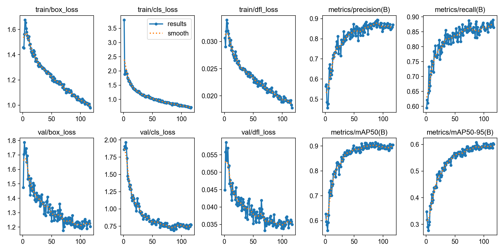

# Home Edge Surveillance Analytics Platform

<p align="left">
  
  
  
  
  
  
  
</p>

The goal is to turn everyday RTSP cameras into an edge analytics platform that can answer practical questions such as:

- is a person near the house right now?
- which camera saw activity first?
- are the cats in the yard, driveway, or front entrance area?
- what detections were worth saving and reviewing later?

## Current status



Phase 1 foundation: a clean local prototype that ingests RTSP streams, runs YOLO-based detection, publishes live artifacts, and exposes a dashboard for review.

- decent frame ingestion from H.265 RTSP cameras
- low-latency latest-frame behavior instead of media-player-style buffering
- real-time detection for people, cars, car plates, and household animals such as cats
- optional object tracking for persistent IDs
- live dashboard views and recent event history

### Goals

- support longer-term storage
- model evaluation
- edge deployment
- secure remote access.

### Current model baseline

The current promoted detector checkpoint is `models/home-surveillance-yolo26m-best.pt`.
It was fine-tuned on the merged `cat`, `dog`, `car`, and `car_plate` dataset at `imgsz=960`,
stopped by early stopping at epoch `117`, and achieved its best validation result at epoch `87`.



Best validation snapshot from April 9, 2026:

- `Precision`: `0.883`
- `Recall`: `0.882`
- `mAP50`: `0.914`
- `mAP50-95`: `0.608`

Per-class `mAP50-95` for the promoted checkpoint:

- `cat`: `0.576`
- `dog`: `0.630`
- `car`: `0.700`
- `car_plate`: `0.524`


## Architecture

```text
+-------------------+     +--------------------+     +----------------------+
|   RTSP Cameras    | --> |   FFmpeg Ingest    | --> |  Latest-Frame Buffer |
| main/sub streams  |     | decode + resize    |     | freshest frame only  |
+-------------------+     +--------------------+     +----------------------+
                                                               |
                                                               v
+-------------------+     +--------------------+     +----------------------+
| Streamlit UI      | <-- |  Event Artifacts   | <-- |  YOLO + Tracking       |
| live + history    |     | images + JSONL     |     | detect people/cars/pets |
+-------------------+     +--------------------+     +----------------------+
```

### Technology stack

- [Python](https://github.com/python/cpython) for orchestration, configuration, and pipeline control.
- [FFmpeg](https://github.com/FFmpeg/FFmpeg) for RTSP ingest, H.265 decode, and frame resizing.
- [OpenCV](https://github.com/opencv/opencv) for preview rendering, overlays, and image encoding.
- [PyTorch](https://github.com/pytorch/pytorch) for model inference, using `mps` locally and CPU in Docker.
- [Ultralytics YOLO26](https://github.com/ultralytics/ultralytics) for person, car, car plate, and pet detection with optional tracking.
- [Streamlit](https://github.com/streamlit/streamlit) for the live dashboard and system view.
- [Docker Compose](https://github.com/docker/compose) for packaging the local dashboard and headless workers.

### Current repository structure

```text
home-edge-surveillance-platform/
  app/
    config/        # runtime settings and environment loading
    dashboard/     # Streamlit UI
    detection/     # YOLO inference and async detection loop
    storage/       # published live artifacts and event records
    stream/        # RTSP / FFmpeg frame ingestion
    ui/            # OpenCV preview layer
    main.py        # main application entrypoint
  configs/         # tracked config templates, including dataset YAML examples
  docs/            # runbooks, architecture notes, and README assets
  models/          # promoted checkpoints committed to the repo
  scripts/         # camera launchers and helper scripts
  Dockerfile
  docker-compose.yml
```

#### 1. Camera layer

The cameras are the source of truth. They expose RTSP streams with both main-stream and substream options. In the current setup, the substream is used for responsive inference and preview.

Current camera hardware: BELLA NET WiFi PTZ ([Amazon listing](https://a.co/d/02plmskC)).

#### 2. Ingestion layer

The ingestion path is built around FFmpeg subprocess piping rather than relying on plain `cv2.VideoCapture`.

#### 3. Detection layer

Ultralytics YOLO26 is used for object detection, with support for `person`, `car`, `car_plate`, and pet-relevant classes such as `cat`. Detection runs asynchronously so the preview and dashboard loop stay responsive even when inference is slower than the camera feed.

Tracking is optional and currently uses Ultralytics-compatible trackers to assign persistent IDs across frames.


#### 4. Event publishing layer

The current build publishes:

- live annotated frames
- per-camera status metadata
- JSONL event logs
- snapshots for notable detections

#### 5. Dashboard layer

The Streamlit dashboard is the operator view of the system. It reads published artifacts and shows:

- live camera snapshots
- recent detections and snapshots
- per-camera health and freshness
- simple review-friendly summaries

## Local development

Minimal setup:

```bash
python3 -m venv .venv
source .venv/bin/activate
pip install -r requirements.txt
cp .env.example .env
python -m app.main --camera cam1
```

To run the dashboard stack:

```bash
bash scripts/run_dashboard_stack.sh
```

To run both cameras:

```bash
python scripts/run_all_cameras.py --enable-yolo --tracking --launch-delay 3.0
```

## Local fine-tuning

The full dataset-prep and fine-tuning workflow lives in [docs/TRAINING_RUNBOOK.md](docs/TRAINING_RUNBOOK.md).

Operational commands, Docker workflows, troubleshooting steps, and off-LAN notes live in [docs/RUNBOOK.md](docs/RUNBOOK.md).
